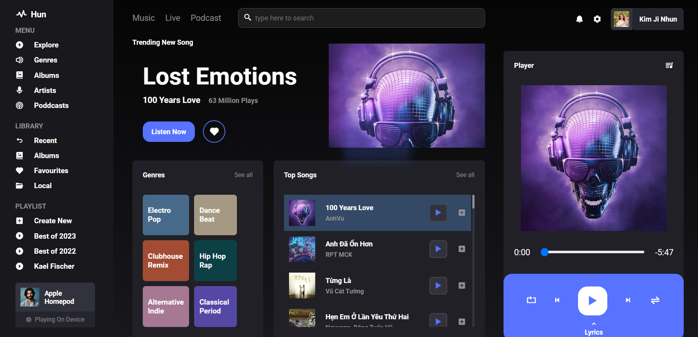
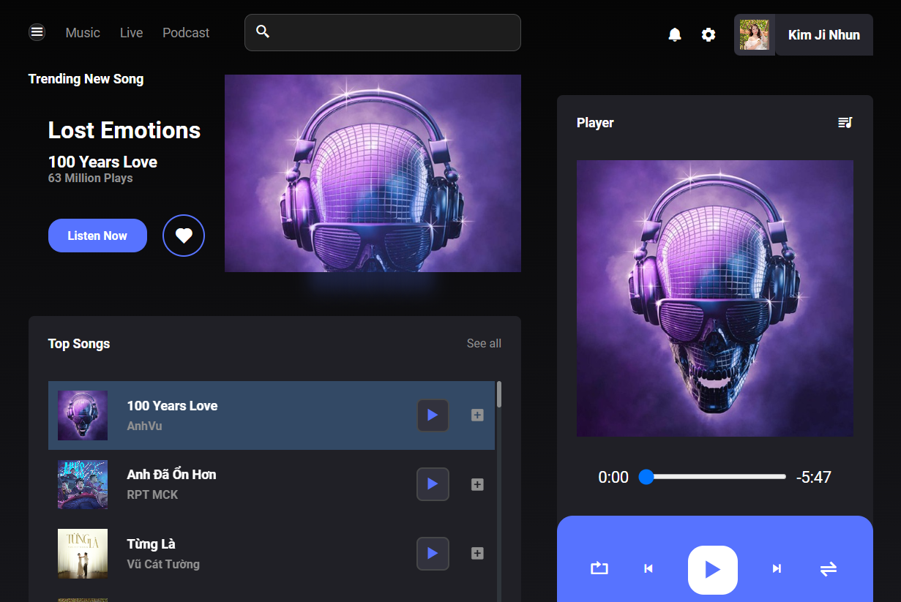
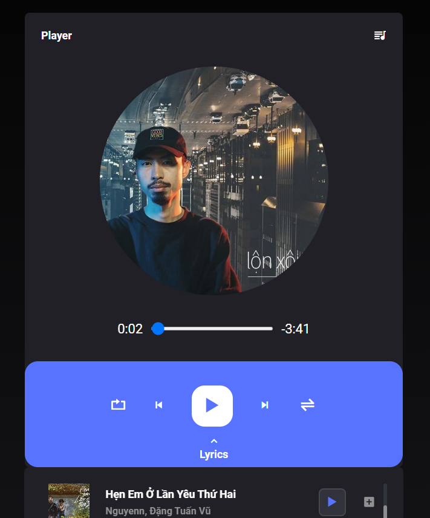

# Music List Website Design

In this project, I have created a simple application to hear surprise, which uses HTML and CSS to create a vivid and user -friendly interface. Besides, JavaScript uses to play music and customize according to the user. A website will surely bring many interesting things to you! Also we have a Sidebar for it! 

# Screenshot with Responsive
* **PC**

* **Tablet**

* **Mobile**

# How to operate
* **Play Music**
You can click on any play buttons and listen now to play music right away with the combination of the Animation effect to dance with music or images that rotate with Mobile.
You can also choose in the music list or in Adbum about the music you choose, the music will be released.
* **Speed**
Increase the speed of playing music and arbitrary sound
* **Accessibility**
If you want to hear a song again, you will click on the loop, which is successful. When clicking next time, you will transfer the song and repeat when the song ends. Click 3 back to the original state when the card will stop. Besides, you can random arbitrary!
* **Lyrics**
Showing lyrics of each song

